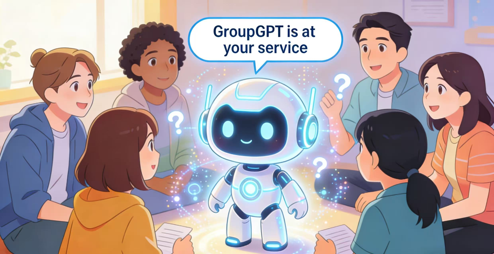

## GroupGPT: A Token-efficient and Privacy-preserving Agentic Framework for Multi-User Chat Assistant

<p align="left">
  <a href="https://arxiv.org/abs/2603.01059"></a>
  <a href="https://github.com/Eliot-Shen/Awesome-Multi-User-Agents"></a>
  <a href="#bibtex"></a>
  <a href="https://docs.google.com/forms/d/e/1FAIpQLSd97FBs7sRq7jHNIcVDqI8sZyG52KGQ8tqmeYIGYkh1fDgLQA/viewform"></a>
  <a href="https://huggingface.co/EliotShen/qwen-3-4b-intervention"></a>
  <a href="https://huggingface.co/EliotShen/llama-3.2-3B-privacy"></a>
</p>


## News

- 🔥We have released a curated list of [**Awesome Multi-User Agents resources**](https://github.com/Eliot-Shen/Awesome-Multi-User-Agents)
- 🔥We have released the weights for GroupGPT’s components.
- 🔥We have released **GroupGPT: A Token-efficient and Privacy-preserving Agentic Framework for Multi-User Chat Assistant**. Check out the [paper](https://arxiv.org/abs/2603.01059).

 

## Overall Framework
|                                                          |
| :------------------------------------------------------------------------------------------------------------------: |
| GroupGPT adopts a small–large model collaborative architecture to decouple intervention timing from response generation, enabling efficient and accurate decision-making. |


## Contents

- [Install](#install)
- [Models](#models)
- [MUIR Dataset](#muir-dataset)
- [Data Curation](#data-curation)
- [Training](#training)
- [Inference](#inference)


### Install

```bash
git clone https://github.com/Eliot-Shen/GroupGPT.git
cd GroupGPT
conda create -n groupgpt python=3.10 -y
conda activate groupgpt
pip install -r requirements.txt
```

### Models
You can found `model weights` via HuggingFace: [🤗 EliotShen/qwen-3-4b-intervention](https://huggingface.co/EliotShen/qwen-3-4b-intervention) and [🤗 EliotShen/llama-3.2-3B-privacy](https://huggingface.co/EliotShen/llama-3.2-3B-privacy).

### MUIR Dataset
Due to privacy considerations, the MUIR dataset is not publicly downloadable.
To request access, please fill out the application [form](https://docs.google.com/forms/d/e/1FAIpQLSd97FBs7sRq7jHNIcVDqI8sZyG52KGQ8tqmeYIGYkh1fDgLQA/viewform).

After review, the dataset will be sent to your email address.

### Data Curation
The `data_curate.py` script demonstrates our data curation pipeline for constructing training data.

- You need to replace the LLM interface in the script with your own API.
- Convert raw multi-user chat logs into JSON format as input.
- The pipeline will automatically process the data and generate the final training dataset.


### Training
We provide training scripts for the key components of GroupGPT:

- **Intervention Judge Model**

  This model determines whether and when the system should intervene in multi-user conversations.

  ```bash
  sh train.sh
  ```
- **Privacy Transcriber Model**
  This module is responsible for privacy-aware rewriting of user inputs.
  ```bash
  sh privacy_train.sh
  ```

Make sure to properly configure the dataset paths and training hyperparameters before running the scripts.

## Inference

### Intervention Judge Model

The **Intervention Judge Model** determines whether the system should intervene in a multi-user group chat and identifies the most appropriate intervention reason.


### Input Format

The model expects a **JSON-formatted group chat context** as input.

Example:

```json
[
  {
    ...
  },
  {
    "user": "Alice",
    "message": "I studied for the exam all night and still feel like I failed..."
  },
  {
    "Intervention": "Emotional Support",
    "Reason": "Users are expressing frustration about the exam."
  },
  {
    "user": "Bob",
    "message": "Same here, that test was brutal."
  },
  {
    "user": "Charlie",
    "message": "Yeah the questions were way harder than the homework."
  }
]
```
This JSON context is inserted into the prompt and sent to the model.

### Output Format

The model outputs a JSON decision indicating whether an intervention is needed.

Example:
```json
{
  "choice": "Emotional Support",
  "reason": "Multiple users express frustration and discouragement about the exam."
}
```
If no intervention is necessary:
```json
{
  "choice": "Stay Silent"
}
```


## BibTeX

```
@article{shen2026groupgpt,
  title={GroupGPT: A Token-efficient and Privacy-preserving Agentic Framework for Multi-User Chat Assistant},
  author={Shen, Zhuokang and Wang, Yifan and Chen, Hanyu and Shen, Yunhang and Huang, Wenxuan and He, Gaoqi and Xie, Jiao and Ji, Rongrong and Lin, Shaohui},
  journal={arXiv preprint arXiv:2603.01059},
  year={2026}
}
```
