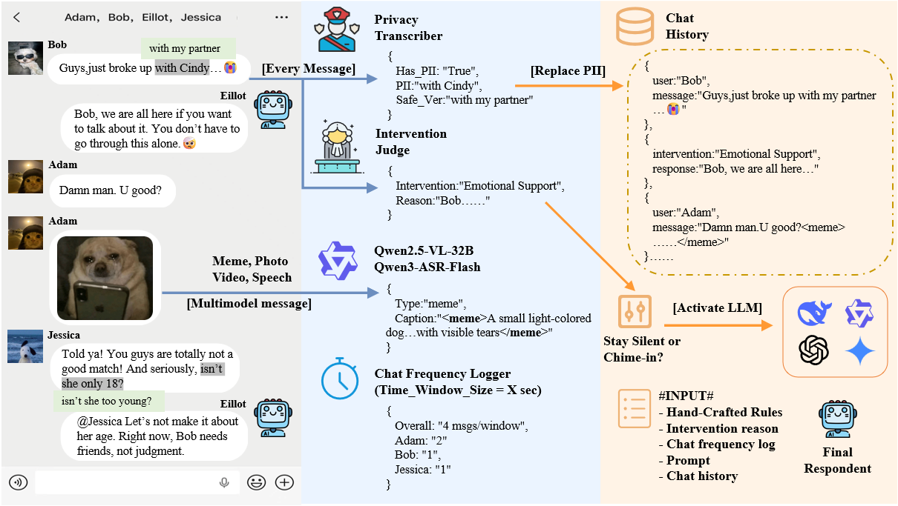

## GroupGPT: A Token-efficient and Privacy-preserving Agentic Framework for Multi-User Chat Assistant

<p align="left">
  <a href="https://arxiv.org/abs/2603.01059"></a>
  <a href="https://github.com/Eliot-Shen/Awesome-Multi-User-Agents"></a>
  <a href="#bibtex"></a>
  <a href="https://docs.google.com/forms/d/e/1FAIpQLSd97FBs7sRq7jHNIcVDqI8sZyG52KGQ8tqmeYIGYkh1fDgLQA/viewform"></a>
  <a href="https://huggingface.co/EliotShen/qwen-3-4b-intervention"></a>
  <a href="https://huggingface.co/EliotShen/llama-3.2-3B-privacy"></a>
</p>


## News

- 🔥We have released a curated list of [**Awesome Multi-User Agents resources**](https://github.com/Eliot-Shen/Awesome-Multi-User-Agents)
- 🔥We have released the weights for GroupGPT’s components.
- 🔥We have released **GroupGPT: A Token-efficient and Privacy-preserving Agentic Framework for Multi-User Chat Assistant**. Check out the [paper](https://arxiv.org/abs/2603.01059).

## Overall Framework
|                                                          |
| :------------------------------------------------------------------------------------------------------------------: |
| GroupGPT adopts a small–large model collaborative architecture to decouple intervention timing from response generation, enabling efficient and accurate decision-making. |


## Contents

- [Install](#install)
- [Models](#models)
- [Training](#Training)
- [Evaluation](#Evaluation)

### Install

```bash
git clone https://github.com/Eliot-Shen/GroupGPT.git
cd GroupGPT
conda create -n groupgpt python=3.10 -y
conda activate groupgpt
pip install -r requirements.txt
```

### Models
You can found `model weights` via HuggingFace: [🤗 EliotShen/qwen-3-4b-intervention](https://huggingface.co/EliotShen/qwen-3-4b-intervention) and [🤗 EliotShen/llama-3.2-3B-privacy](https://huggingface.co/EliotShen/llama-3.2-3B-privacy).

### Training


### Evaluation


## BibTeX

```
@article{shen2026groupgpt,
      title={GroupGPT: A Token-efficient and Privacy-preserving Agentic Framework for Multi-User Chat Assistant}, 
      author={Zhuokang Shen and Yifan Wang and Hanyu Chen and Wenxuan Huang and Shaohui Lin},
      year={2026},
      journal={arXiv preprint arXiv:2603.01059}
}
```
